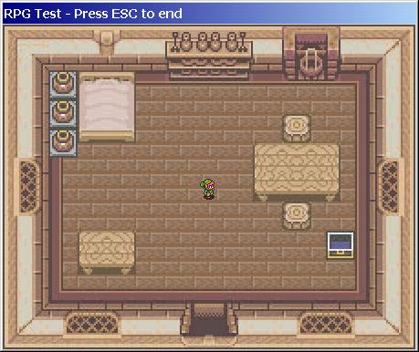

## RPG Game \- VERY Early Alpha UPDATE \- NEW COLLISION DETECTION

### Description

Simple Test for a quite easy RPG Engine. Now updated with a new collision detection. NOTE : CREDITS FOR THE NEW COLLISION DETECTION METHOD GOES TO CODING GENIUS, HE TOLD ME THAT (in fact he wrote it). Please tell me waht you think about it !
 
### More Info
 

             |
---                |---
**Submitted On**   |2001-10-19 13:58:52
**By**             |[Thomas Sturm](https://github.com/Planet-Source-Code/PSCIndex/blob/master/ByAuthor/thomas-sturm.md)
**Level**          |Intermediate
**User Rating**    |4.3 (34 globes from 8 users)
**Compatibility**  |VB 6\.0
**Category**       |[Games](https://github.com/Planet-Source-Code/PSCIndex/blob/master/ByCategory/games__1-38.md)
**World**          |[Visual Basic](https://github.com/Planet-Source-Code/PSCIndex/blob/master/ByWorld/visual-basic.md)
**Archive File**   |[RPG Game \-3005210202001\.zip](https://github.com/Planet-Source-Code/thomas-sturm-rpg-game-very-early-alpha-update-new-collision-detection__1-28212/archive/master.zip)

